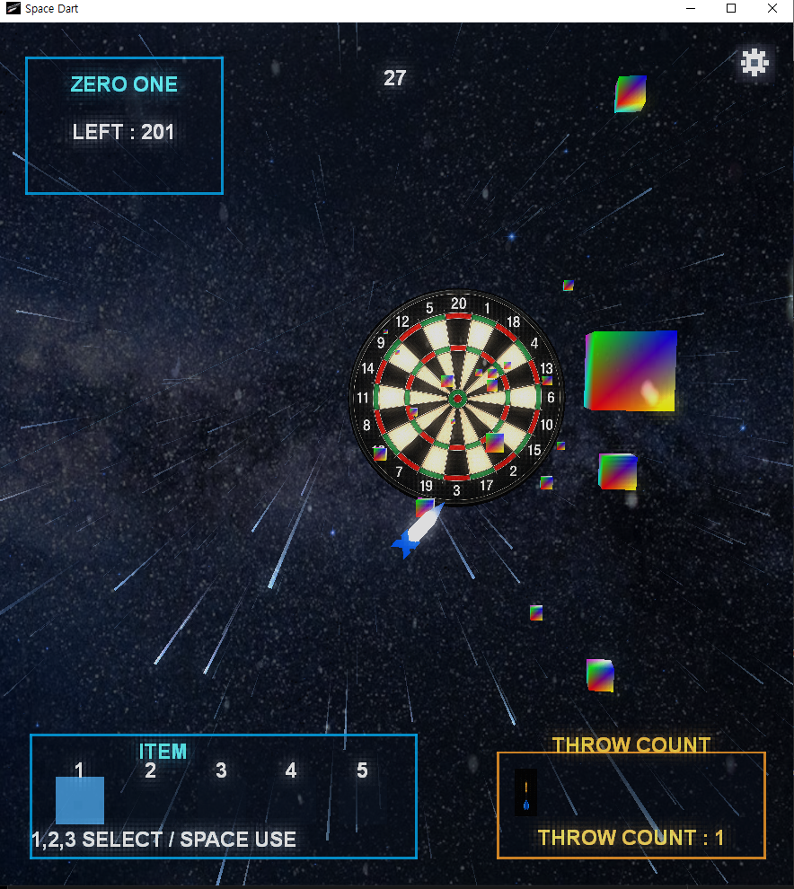
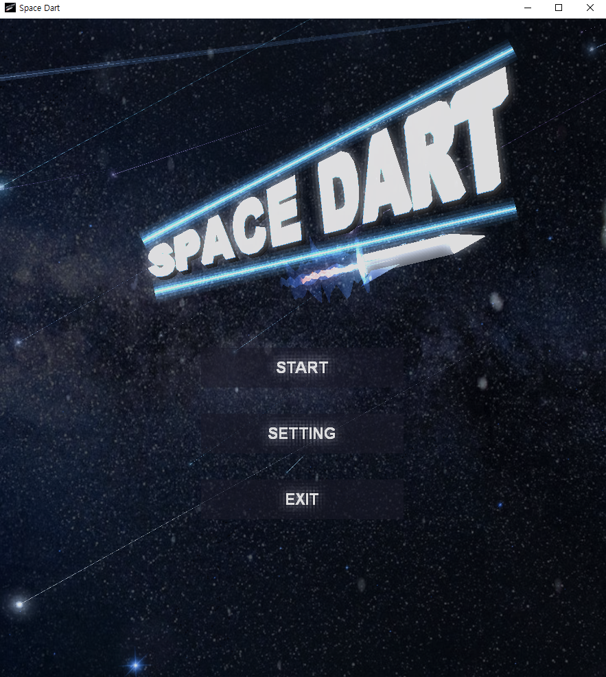
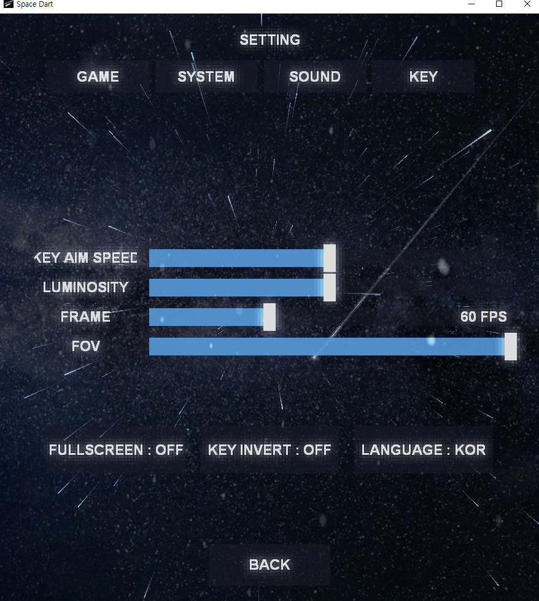
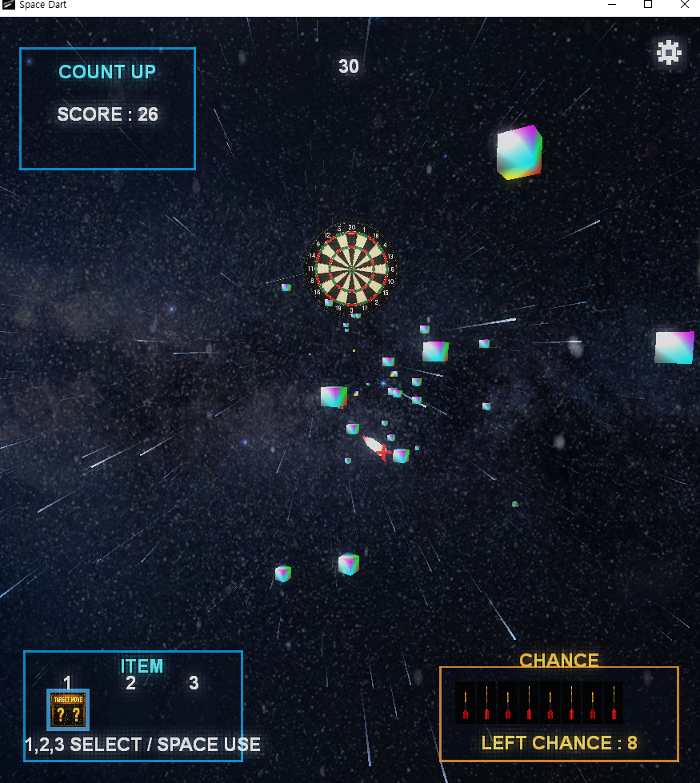
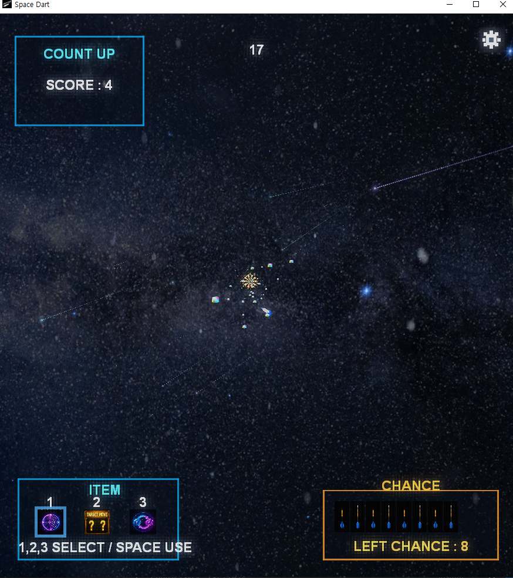
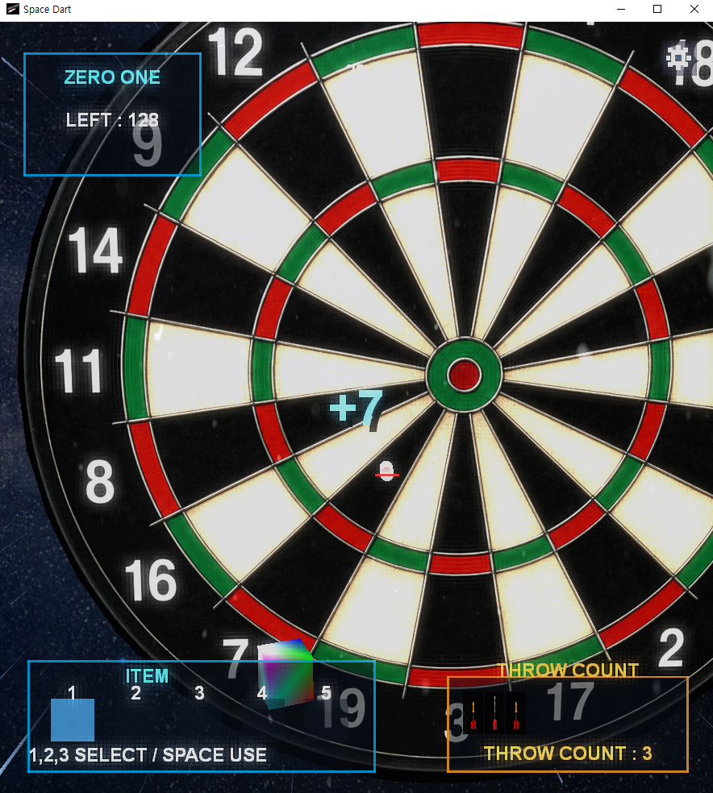
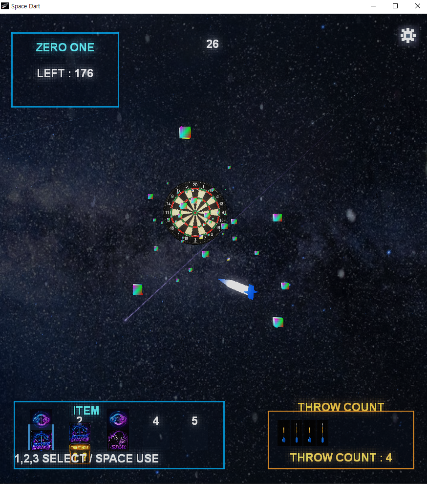

# Space Dart

C++과 DirectX 9을 사용하여 직접 구현한 3D 다트 아케이드 게임입니다.

게임의 기본적인 렌더링부터 입력 처리, Scene 관리, 충돌 및 점수 계산,
컴퓨터 플레이어의 행동 로직, 우주 배경 렌더링 등을 직접 구현했습니다.

---

## 개발 정보

- 개발 기간: 2026.05 ~ 2026.08
- 개발 인원: 1인
- 프로젝트 형태: 개인 프로젝트
- 현재 상태: 출시 준비 중

---

## 개발 환경

- Language: C++
- Graphics API: DirectX 9
- Platform: Windows
- IDE: Visual Studio

---

# What I Learned

Space Dart를 개발하면서 C++을 단순히 문법을 사용하는 언어가 아니라,
게임에 필요한 기능을 구조화하고 실제 플레이 가능한 시스템으로 연결하는 도구로 사용했습니다.

기능을 구현할 때는 처음부터 모든 기능을 완성하려 하기보다
필요한 요소를 작은 단위로 나누어 구현하고 결과를 확인하는 방식으로 개발했습니다.

예상과 다른 결과가 발생했을 때는 단순히 코드를 수정하는 것이 아니라
관련된 값과 코드의 실행 흐름을 하나씩 확인하면서 원인을 좁혀갔습니다.

이 프로젝트를 통해 다음과 같은 개발 방식을 경험했습니다.

- 기능의 역할을 나누고 클래스와 Scene 단위로 구조화하는 방법
- 입력 → 게임 로직 → 렌더링으로 이어지는 게임의 실행 흐름
- 예상과 다른 결과가 발생했을 때 값과 코드 흐름을 확인하며 원인을 추적하는 방법
- 익숙하지 않은 기능을 작은 단위부터 구현하고 결과를 확인하며 확장하는 방법

특히 게임을 완성하는 과정에서 단순히 기능을 구현하는 것뿐만 아니라,
**왜 문제가 발생했는지 확인하고 필요한 기능을 직접 설계하여 해결하는 과정이 중요하다는 것을 배웠습니다.**

---

# 주요 기능

## 1. Scene Management

Title, Play, Setting 등의 화면을 Scene 단위로 분리하고,
Manager를 통해 Scene의 생성, 전환 및 실행 흐름을 관리하도록 구성했습니다.

각 화면의 역할을 분리하여 하나의 코드에 게임의 전체 흐름이 집중되지 않도록 구성했습니다.

### 주요 구성

- Title Scene
- Play Scene
- Setting Scene
- Scene 전환 관리

---

## 2. Input & UI

WinAPI 입력을 프레임 단위로 처리하고,
현재 프레임과 이전 프레임의 입력 상태를 비교하여 키와 마우스 입력을 처리했습니다.

이를 통해 버튼을 한 번 클릭했을 때 여러 번 입력되는 문제를 방지하도록 구현했습니다.

DirectX 환경에서 UI를 처리하기 위해 `CButton` 클래스를 별도로 구현했습니다.

버튼의 상태를 구분하여 마우스 입력에 따라 UI의 상태와 렌더링이 변경되도록 구성했습니다.

- Hover
- Pressed
- Clicked

---

## 3. Computer Player

컴퓨터 플레이어가 단순히 임의의 위치에 다트를 던지는 것이 아니라,
현재 게임 상황을 기준으로 목표와 행동을 선택하도록 규칙 기반으로 구현했습니다.

판단에 필요한 기능을 여러 단계로 나누어
현재 상황에 따라 목표를 결정하도록 구성했습니다.

### 주요 판단 요소

- 난이도에 따른 명중 오차 조절
- 현재 필요한 점수에 따른 목표 위치 결정
- 아이템 보유 및 획득 여부 판단
- 아이템 효과에 따른 행동 변경
- 움직이는 다트판의 현재 위치와 이동 방향을 고려한 목표 보정
- 게임 진행 상황에 따른 행동 전략 변경

---

## 4. Space Rendering

단순한 배경 텍스처만 사용하는 대신
공간감을 표현하기 위해 별과 유성을 직접 구현했습니다.

처음에는 별 이미지를 여러 위치에 배치했지만,
이미지가 공간에 떠 있는 것처럼 보여 원하는 깊이감을 표현하기 어려웠습니다.

이를 개선하기 위해 별을 거리별로 나누고
크기, 밝기, 반짝임의 속도와 강도를 다르게 설정했습니다.

유성은 카메라와의 거리를 기준으로 비율값을 계산하여
거리에 따라 다음 요소가 달라지도록 구성했습니다.

- 이동 속도
- 크기
- 폭
- 꼬리 길이
- 밝기

이를 통해 같은 형태의 오브젝트가 반복적으로 이동하는 것보다
거리감이 느껴지는 우주 공간을 표현하고자 했습니다.

---

## 5. Collision & Score

다트판의 각 영역과 실제 다트가 충돌한 위치를 기준으로
점수를 계산하도록 구현했습니다.

초기에는 다트가 다트판에 정상적으로 맞았음에도
화면에서 보이는 위치와 실제 계산된 점수가 일치하지 않는 문제가 있었습니다.

처음에는 점수 계산 로직을 확인했지만,
문제의 원인은 점수 공식이 아니라 **충돌 위치의 기준 좌표**였습니다.

다트 오브젝트의 위치와 실제 다트의 핀이 접촉하는 위치가 달랐기 때문에
충돌 기준을 다트의 실제 핀 위치로 다시 설정했습니다.

이후 여러 영역에 다트를 던져
화면상의 충돌 위치와 계산된 점수가 일치하는지 확인했습니다.

---

## 6. Item & Game Rule

게임에는 기본적인 다트 플레이 외에도
게임 상황에 변화를 주는 아이템과 규칙을 구현했습니다.

아이템에 따라 다트판이나 플레이 상황에 변화가 발생하며,
컴퓨터 플레이어 역시 현재 적용된 효과를 확인하여 행동을 변경하도록 구성했습니다.

---

# Gameplay

Space Dart는 일반적인 다트 규칙을 기반으로
여러 게임 모드와 아이템 요소를 결합한 3D 다트 게임입니다.

플레이어는 다트를 조준하여 목표 지점에 던지고,
다트가 충돌한 위치를 기준으로 점수가 계산됩니다.

게임 중에는 다트판의 상태와 아이템 효과 등에 따라
조준 조건이 달라질 수 있습니다.

---

# 현재 개선 중인 부분

현재 기본적인 게임 플레이와 주요 시스템은 구현되어 있으며,
출시를 목표로 추가적인 완성도 개선을 진행하고 있습니다.

### Sound

현재 부족한 사운드 요소를 추가하여
다트 투척, 충돌, UI 및 게임 상황에 따른 피드백을 강화할 예정입니다.

### Space Background

현재 구현된 별과 유성에 더해
블랙홀과 행성 등의 우주 오브젝트를 추가하고,
각 요소의 표현 품질을 개선할 예정입니다.

### Story Scene

현재 스토리 Scene은 비주얼 노벨과 유사한 대화 방식으로 구현되어 있습니다.

향후에는 두 캐릭터가 한 화면에 등장하도록 구성하고,
현재 대화 중인 캐릭터를 확대하여 대화 주체를 명확하게 표현할 예정입니다.

또한 캐릭터의 입 모양 애니메이션을 추가하여
대화 장면의 시각적 완성도를 높일 계획입니다.

---

# Repository

전체 소스 코드는 이 Repository에서 확인할 수 있습니다.

C++과 DirectX 9을 사용하여 게임의 구조부터 렌더링,
입력, 충돌, UI, 컴퓨터 플레이어 로직까지 직접 구현했습니다.

## Source Code Guide

| System | Main Source |
| --- | --- |
| Scene Management | `Space Dart/CGameManager.cpp`, `Space Dart/CScene.h` |
| Input / UI | `Space Dart/KeyProc.cpp`, `Space Dart/CButton.cpp` |
| Computer Player | `Space Dart/CThink.cpp`, `Space Dart/CThink_Target.cpp`, `Space Dart/CThink_Risk.cpp`, `Space Dart/CThink_Item.cpp`, `Space Dart/CThink_Difficulty.cpp` |
| Space Rendering | `Space Dart/CSpaceBackground.cpp`, `Space Dart/CSpaceRenderer.cpp` |
| Collision / Score | `Space Dart/CCollision.cpp`, `Space Dart/CDart.cpp` |
